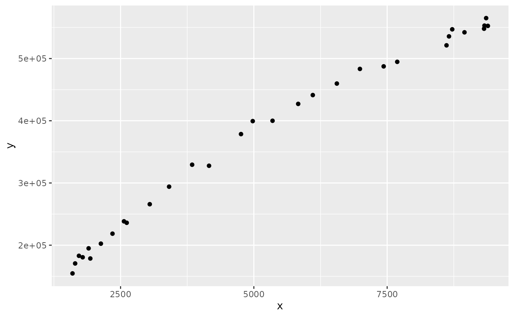

# Modify a FIMS module to make it callable from RTMB

## Step 1 Navigate to the rcpp directory and rcpp file of interest

The rcpp directory is located in
`inst/include/interface/rcpp/rcpp_objects`. Here, Rcpp interface files
are listed by category, e.g. `rcpp_growth`, `rcpp_selectivity`, etc.
This vignette will walk through modifying the Beverton-Holt recruitment
function in `rcpp_recruitment.hpp` to make it callable from RTMB.

At the top of the file, add the following if it isn’t already included:

``` r
#include "../../RTMB.h"
```

## Step 2 Locate the Beverton-Holt recruitment `evaluate_mean` function in `rcpp_recruitment`

Find the `BevertonHoltRecruitmentInterface`. Within this class, locate
the `evaluate_mean` function, this is where the Beverton-Holt C++
function is called. Note in other modules, this function will just be
called `evaluate()` This function needs to be copied and the copy then
modified to be callable from RTMB.

``` r
 virtual double evaluate_mean(double spawners, double phi_0) {
    fims_popdy::SRBevertonHolt<double> BevHolt;
    BevHolt.logit_steep.resize(1);
    BevHolt.logit_steep[0] = this->logit_steep[0].initial_value_m;
    if (this->logit_steep[0].initial_value_m == 1.0) {
      Rcpp::warning(
        "Steepness is subject to a logit transformation. "
        "Fixing it at 1.0 is not currently possible."
      );
    }
    BevHolt.log_rzero.resize(1);
    BevHolt.log_rzero[0] = this->log_rzero[0].initial_value_m;

    return BevHolt.evaluate_mean(spawners, phi_0);
  }
```

## Step 3: Create a copy of this function.

Rename it to `evaluate_mean_RTMB` and modify the type from
`virtual double` to `ADrep`. Add documentation and wrap the entire
function in:

``` r
#ifdef TMB_MODEL 
...
#endif
```

This will ensure that this function is only compiled when TMB is being
used.

``` r
#ifdef TMB_MODEL
    /**
   * @brief Evaluate recruitment using the Beverton--Holt stock--recruitment
   * relationship.
   * @param spawners Spawning biomass per time step.
   * @param phi_0 The biomass at unfished levels.
   */
   ADrep evaluate_mean_RTMB(double spawners, double phi_0) {
    fims_popdy::SRBevertonHolt<double> BevHolt;
    BevHolt.logit_steep.resize(1);
    BevHolt.logit_steep[0] = this->logit_steep[0].initial_value_m;
    if (this->logit_steep[0].initial_value_m == 1.0) {
      Rcpp::warning(
        "Steepness is subject to a logit transformation. "
        "Fixing it at 1.0 is not currently possible."
      );
    }
    BevHolt.log_rzero.resize(1);
    BevHolt.log_rzero[0] = this->log_rzero[0].initial_value_m;

    return BevHolt.evaluate_mean(spawners, phi_0);
  }
  #endif
```

## Step 4: Modify types:

- Modify the types of the input parameters from `double` to `ADrep`
- Modify the type within the class declaration function from `double` to
  `ad`, e.g. `fims_popdy::SRBevertonHolt<double>` to
  `fims_popdy::SRBevertonHolt<ad>`

``` r
 ADrep evaluate_mean_RTMB(ADrep spawners, ADrep phi_0) {
  fims_popdy::SRBevertonHolt<ad> BevHolt;
  BevHolt.logit_steep.resize(1);
  BevHolt.logit_steep[0] = this->logit_steep[0].initial_value_m;
  if (this->logit_steep[0].initial_value_m == 1.0) {
    Rcpp::warning(
      "Steepness is subject to a logit transformation. "
      "Fixing it at 1.0 is not currently possible."
    );
  }
  BevHolt.log_rzero.resize(1);
  BevHolt.log_rzero[0] = this->log_rzero[0].initial_value_m;

  return BevHolt.evaluate_mean(spawners, phi_0);
}
```

## Step 5: Add new pointers for each parameter

For each input parameter, set up a new pointer using `const ad*` and
wrap the input parameter in `adptr()`. If there are additional
parameters in the model that are not specified in the input,
e.g. `logit_steep`, add them as parameters to the input and set up new
pointers for them:

``` r
   ADrep evaluate_mean_RTMB(ADrep spawners, ADrep phi_0, ADrep logit_steep, ADrep log_rzero) {
    fims_popdy::SRBevertonHolt<ad> BevHolt;
    const ad* spawners_ptr = adptr(spawners);
    const ad* phi_0_ptr = adptr(phi_0);
    const ad* logit_steep_ptr = adptr(logit_steep);
    const ad* log_rzero_ptr = adptr(log_rzero);
    
    BevHolt.logit_steep.resize(1);
    BevHolt.logit_steep[0] = this->logit_steep[0].initial_value_m;
    if (this->logit_steep[0].initial_value_m == 1.0) {
      Rcpp::warning(
        "Steepness is subject to a logit transformation. "
        "Fixing it at 1.0 is not currently possible."
      );
    }
    BevHolt.log_rzero.resize(1);
    BevHolt.log_rzero[0] = this->log_rzero[0].initial_value_m;

    return BevHolt.evaluate_mean(spawners, phi_0);
  }
```

## Step 6: Set parameters to pointers

- For parameters that are set within the function, set them to equal the
  value of each pointer, e.g. `= *logit_steep_ptr`
- For parameters that are passed as input to the `evaluate_mean`, pass
  in the pointers instead

``` r
   ADrep evaluate_mean_RTMB(ADrep spawners, ADrep phi_0, ADrep logit_steep, ADrep log_rzero) {
    fims_popdy::SRBevertonHolt<ad> BevHolt;
    const ad* spawners_ptr = adptr(spawners);
    const ad* phi_0_ptr = adptr(phi_0);
    const ad* logit_steep_ptr = adptr(logit_steep);
    const ad* log_rzero_ptr = adptr(log_rzero);

    BevHolt.logit_steep.resize(1);
    BevHolt.logit_steep[0] = *logit_steep_ptr;
    if (BevHolt.logit_steep[0] == 1.0) {
      Rcpp::warning(
        "Steepness is subject to a logit transformation. "
        "Fixing it at 1.0 is not currently possible."
      );
    }
    BevHolt.log_rzero.resize(1);
    BevHolt.log_rzero[0] = *log_rzero_ptr;

    return BevHolt.evaluate_mean(spawners_ptr, phi_0_ptr);
  }
```

## Step 7: Modify the return statement

The following code needs to be added to make the return callable from
RTMB:

``` r
int n = x.size();
ADrep ans(n); 
ad* Y = adptr(ans); 
```

where x is the input variable.

The return function then needs to be set as a loop over all input and
the return modified to `ans`:

``` r
for(int i=0; i<n; i++){
  Y[i] = module.evaluate(x[i]);
}
return ans; 
```

The completed function for Beverton-Holt is:

``` r
  #ifdef TMB_MODEL
    /**
   * @brief Evaluate recruitment using the Beverton--Holt stock--recruitment
   * relationship.
   * @param spawners Spawning biomass per time step.
   * @param phi_0 The biomass at unfished levels.
   */
   ADrep evaluate_mean_RTMB(ADrep spawners, ADrep phi_0, ADrep logit_steep, ADrep log_rzero) {
    fims_popdy::SRBevertonHolt<ad> BevHolt;
    const ad* spawners_ptr = adptr(spawners);
    const ad* phi_0_ptr = adptr(phi_0);
    const ad* logit_steep_ptr = adptr(logit_steep);
    const ad* log_rzero_ptr = adptr(log_rzero);

    BevHolt.logit_steep.resize(1);
    BevHolt.logit_steep[0] = *logit_steep_ptr;
    if (BevHolt.logit_steep[0] == 1.0) {
      Rcpp::warning(
        "Steepness is subject to a logit transformation. "
        "Fixing it at 1.0 is not currently possible."
      );
    }
    BevHolt.log_rzero.resize(1);
    BevHolt.log_rzero[0] = *log_rzero_ptr;

    int n = spawners.size();
    ADrep ans(n); 
    ad* Y = adptr(ans); 
    for(int i=0; i<n; i++){
        Y[i] = BevHolt.evaluate_mean(spawners_ptr[i], phi_0_ptr[0]);
    }
  
    return ans; 
  }
  #endif
```

## Step 8: Expose to R

The final step is to expose this new function to R. Navigate to the
`fims_module.hpp` file under `src` Scroll down to the BevertonHolt
interface:
`Rcpp::class_<BevertonHoltRecruitmentInterface>("BevertonHoltRecruitment")`.
Add the the following to the list of methods:

``` r
  .method("evaluate_mean_RTMB", &BevertonHoltRecruitmentInterface::evaluate_mean_RTMB)
```

The final interface code chunk should look like:

``` r
 Rcpp::class_<BevertonHoltRecruitmentInterface>("BevertonHoltRecruitment")
      .constructor()
      .field("logit_steep", &BevertonHoltRecruitmentInterface::logit_steep)
      .field("log_rzero", &BevertonHoltRecruitmentInterface::log_rzero)
      .field("log_devs", &BevertonHoltRecruitmentInterface::log_devs)
      .field("log_r", &BevertonHoltRecruitmentInterface::log_r,
             "recruitment as a random effect on the natural log scale")
      .field("nyears", &BevertonHoltRecruitmentInterface::nyears,
             "Number of years")
      .field("log_expected_recruitment",
             &BevertonHoltRecruitmentInterface::log_expected_recruitment,
             "Log expectation of the recruitment process")
      .method("get_id", &BevertonHoltRecruitmentInterface::get_id)
      .method("SetRecruitmentProcessID",
              &BevertonHoltRecruitmentInterface::SetRecruitmentProcessID,
              "Set unique ID for recruitment process")
      .method("evaluate_mean_RTMB", &BevertonHoltRecruitmentInterface::evaluate_mean_RTMB,
                "Evaluate the mean recruitment using the RTMB framework")
      .method("evaluate_mean",
              &BevertonHoltRecruitmentInterface::evaluate_mean);
```

## Step 9: Use function in RTMB Modeling

Setup the RTMB environment:

``` r
library(FIMSRTMB)
FIMSRTMB:::setup_RTMB()
```

    ## Global pointer successfully set: 0x7f4a6c1f48a0

``` r
library(ggplot2)

# clear memory
clear()
```

### Set up a recruitment module using FIMS

``` r
recruitment <- methods::new(BevertonHoltRecruitment)
recruitment$show()
```

    ## Reference class object of class "Rcpp_BevertonHoltRecruitment"
    ## Field "log_devs":
    ## 0x55d9e146fc80
    ## {"id": 3,
    ## "value": 0,
    ## "estimated_value": 0,
    ## "estimation_type": "constant"
    ## }  Field "log_expected_recruitment":
    ## 0x55d9e18b21e0
    ## {"id": 5,
    ## "value": 0,
    ## "estimated_value": 0,
    ## "estimation_type": "constant"
    ## }  Field "log_r":
    ## 0x55d9db085c70
    ## {"id": 4,
    ## "value": 0,
    ## "estimated_value": 0,
    ## "estimation_type": "constant"
    ## }  Field "log_rzero":
    ## 0x55d9e675fe50
    ## {"id": 2,
    ## "value": 0,
    ## "estimated_value": 0,
    ## "estimation_type": "constant"
    ## }  Field "logit_steep":
    ## 0x55d9df7d5b40
    ## {"id": 1,
    ## "value": 0,
    ## "estimated_value": 0,
    ## "estimation_type": "constant"
    ## }  Field "n_years":
    ## C++ object <0x55d9e3067380> of class 'SharedInt' <0x55d9e27bbf20>

### Simulate data using the FIMS module

``` r
# set the two parameters from the recruitment module:
r0 <- 1e+06; h <- 0.75; phi_0 <- 0.1
recruitment$log_rzero[1]$value <- log(r0)
recruitment$logit_steep[1]$value <- FIMSRTMB::logit(0.2, 1.0, 0.75);

#spawners from FIMS comparison test data
X <- c(9317.537, 9388.807, 9356.490, 9325.130, 8950.209, 8720.467, 8659.642, 8613.245, 7689.096,
        7434.469, 6989.143, 6556.460, 6105.419, 5831.374, 5350.386, 4978.918, 4758.962, 4159.215,
        3842.397, 3410.286, 3047.454, 2564.075, 2615.329, 2348.742, 2130.985, 1932.811, 1900.979,
        1789.534, 1598.782, 1719.572, 1648.269)
Y <- mu <- X * 0
sdy <- 7500 #observation error around bevertonholt

set.seed(123)
for(i in seq_along(X)){
    # evaluate returns the bevertonholt function given the parameters and x
    mu[i] <- recruitment$evaluate_mean(X[i], phi_0)
    # simulate random noise around the mean
    Y[i] <- rnorm(1, mu[i], sdy)
}

df <- data.frame(x = X, y = Y)
ggplot(df, aes(x = x, y = y)) + geom_point()
```



### Set up RTMB model

``` r
dat <- list(y = Y, x = X)
par <- list(log_rzero = log(max(Y)), logit_steep = 0,
            ln_sdy = log(1000))

mod <- function(par){
    getAll(par, dat)
    sdy <- exp(par$ln_sdy)
    mean_recruitment <- recruitment$evaluate_mean_RTMB(
        spawners = advector(dat$x), phi_0 = advector(0.1),
        logit_steep = advector(par$logit_steep),
        log_rzero = advector(par$log_rzero)
    )
    nll <- 0
    for(i in seq_along(x)){
        nll <- nll - RTMB::dnorm(y[i], mean_recruitment[i], sdy, TRUE)
    }
    return(nll)
}
```

### Generate TMB object and optimize

``` r
obj <- RTMB::MakeADFun(mod, par)
opt <- nlminb(obj$par, obj$fn, obj$gr)
```

    ## outer mgc:  1018152 
    ## outer mgc:  82367.92 
    ## outer mgc:  54060.36 
    ## outer mgc:  20589.24 
    ## outer mgc:  16981.42 
    ## outer mgc:  3841.6 
    ## outer mgc:  2542.75 
    ## outer mgc:  1042.539 
    ## outer mgc:  2049.42 
    ## outer mgc:  1160.555 
    ## outer mgc:  854.7764 
    ## outer mgc:  913.3611 
    ## outer mgc:  825.0972 
    ## outer mgc:  300.6294 
    ## outer mgc:  157.265 
    ## outer mgc:  43.9615 
    ## outer mgc:  20.57949 
    ## outer mgc:  8.150058 
    ## outer mgc:  4.185564 
    ## outer mgc:  2.558583 
    ## outer mgc:  0.9774273 
    ## outer mgc:  0.5983629 
    ## outer mgc:  0.2017957 
    ## outer mgc:  0.1237911 
    ## outer mgc:  0.009367911 
    ## outer mgc:  0.001011514

``` r
opt$par
```

    ##   log_rzero logit_steep      ln_sdy 
    ##  13.8394270   0.7699375   8.8467662

``` r
r0; exp(opt$par["log_rzero"])
```

    ## [1] 1e+06

    ## log_rzero 
    ##   1024205

``` r
h; FIMSRTMB::inv_logit(0.2, 1.0, opt$par["logit_steep"])
```

    ## [1] 0.75

    ## [1] 0.7468059
