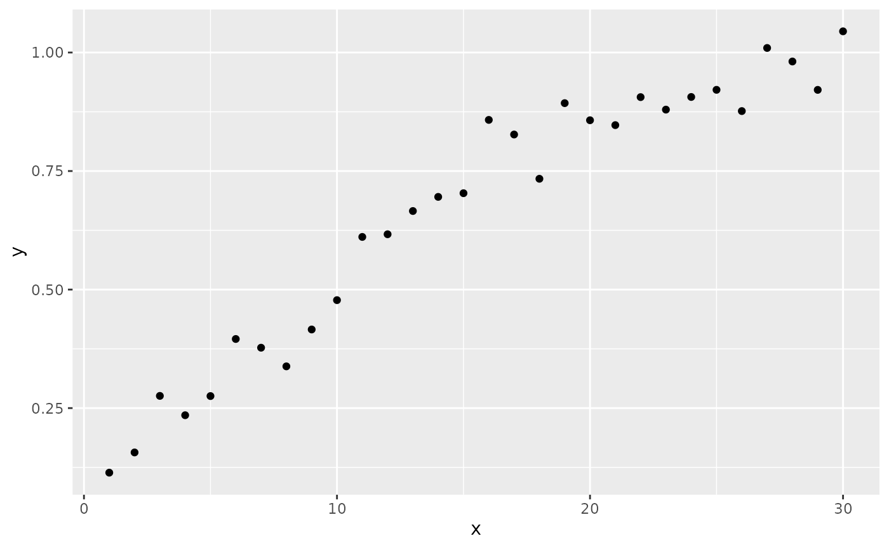

# Call FIMS module from RTMB

## FIMS-RTMB Example

This demo uses a FIMS module to set up an RTMB model.

``` r
library(FIMSRTMB)
FIMSRTMB:::setup_RTMB()
```

    ## Global pointer successfully set: 0x7f707c1f48a0

``` r
library(ggplot2)

# clear memory
clear()
```

### Set up a logistic module using FIMS

``` r
logistic <- methods::new(LogisticSelectivity)
```

### Simulate data using the FIMS module

``` r
# set the two parameters from the logistic module:
#   inflection_point and slope
logistic$inflection_point[1]$value <- 10.0
logistic$slope[1]$value <- 0.2
X <- 1:30
Y <- mu <- X * 0
sdy <- 0.05 #observation error around logistic

set.seed(123)
for(i in X){
    # evaluate returns the logistic function given the parameters and x 
    mu[i] <- logistic$evaluate(X[i])
    # simulate random noise around the mean
    Y[i] <- rnorm(1, mu[i], sdy)
}

df <- data.frame(x = X, y = Y)
ggplot(df, aes(x = x, y = y)) + geom_point()
```



### Set up RTMB model

``` r
dat <- list(y = Y, x = X)
par <- list(inflection_point = 10, slope = 0.2,
            ln_sdy = 0)

mod <- function(par){
    getAll(par, dat)
    sdy <- exp(par$ln_sdy)
    mean_selectivity <- logistic$evaluate_RTMB(
        x = advector(x),
        inflection_point = advector(par$inflection_point),
        slope = advector(par$slope)
    )
    nll <- 0
    for(i in seq_along(x)){
        nll <- nll - RTMB::dnorm(y[i], mean_selectivity[i], sdy, TRUE)
    }
    return(nll)
}
```

### Generate TMB object and optimize

``` r
obj <- RTMB::MakeADFun(mod, par)
opt <- nlminb(obj$par, obj$fn, obj$gr)
```

    ## outer mgc:  29.93006 
    ## outer mgc:  29.50302 
    ## outer mgc:  512.6907 
    ## outer mgc:  218.1737 
    ## outer mgc:  72.97432 
    ## outer mgc:  82.41938 
    ## outer mgc:  37.30409 
    ## outer mgc:  0.9372692 
    ## outer mgc:  11.07212 
    ## outer mgc:  5.289398 
    ## outer mgc:  3.868949 
    ## outer mgc:  0.6818801 
    ## outer mgc:  3.179516 
    ## outer mgc:  1.391376 
    ## outer mgc:  3.705423 
    ## outer mgc:  0.341448 
    ## outer mgc:  0.008789876 
    ## outer mgc:  0.0006018996 
    ## outer mgc:  1.274528e-05

``` r
opt$par
```

    ## inflection_point            slope           ln_sdy 
    ##        9.8550441        0.1874293       -3.0572592
